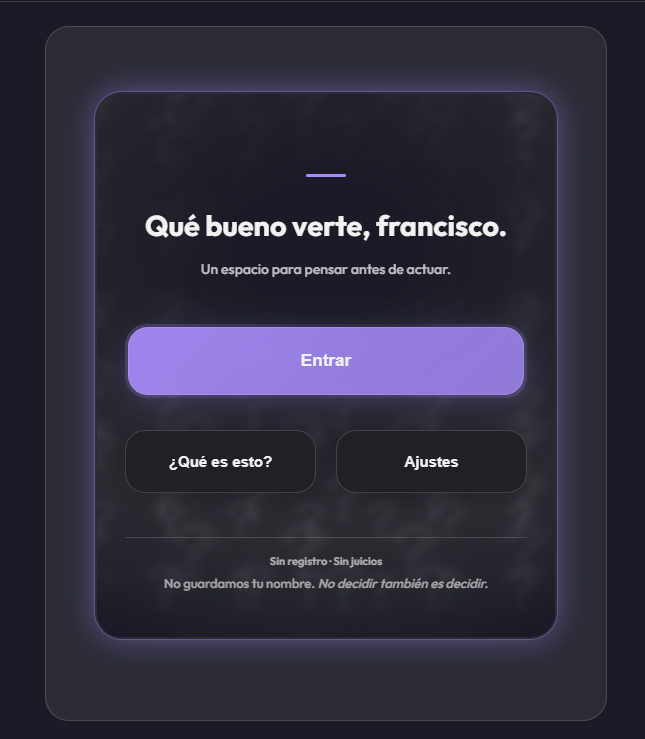
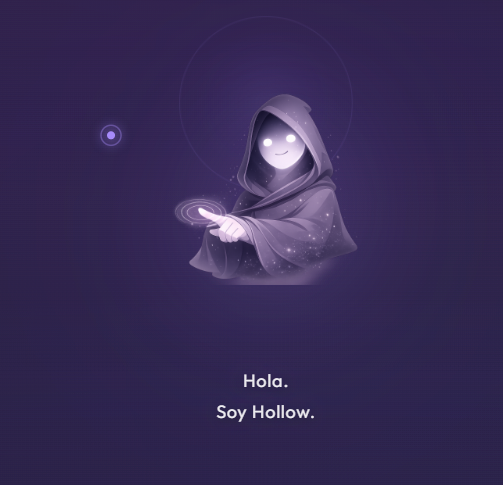
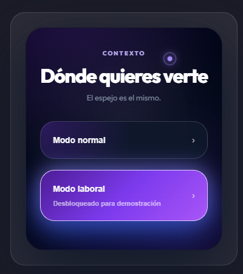
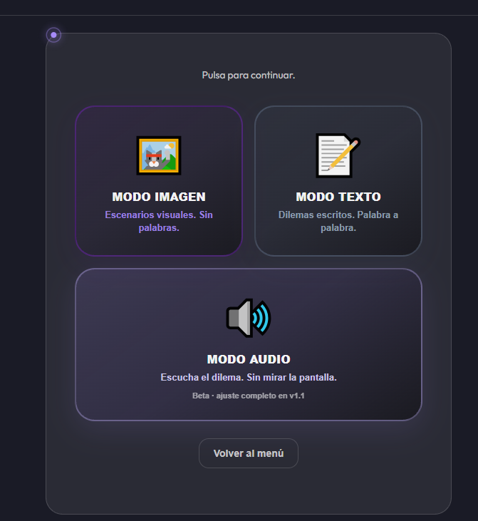
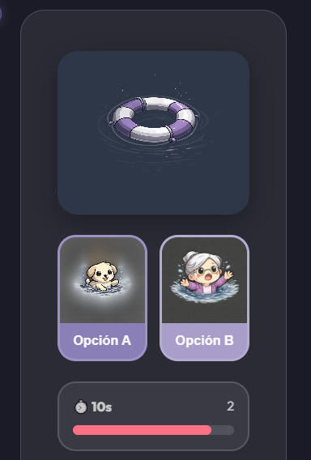

<div align="center">

# REFLEXA

### Piensa. Decide. Reflexiona.

Una experiencia interactiva que plantea dilemas bajo presión y utiliza inteligencia artificial para generar una reflexión basada en las decisiones tomadas.

[🌐 Probar REFLEXA](https://iareflexa.netlify.app/)

</div>

---

## 🪞 ¿Qué es REFLEXA?

**REFLEXA** es una aplicación web interactiva diseñada para explorar cómo tomamos decisiones ante diferentes situaciones.

A través de dilemas presentados en distintos formatos, el usuario debe elegir entre diferentes alternativas mientras REFLEXA registra sus respuestas.

Al finalizar, una inteligencia artificial analiza el conjunto de decisiones y genera una **reflexión personalizada**, buscando tensiones, patrones y contrastes entre las elecciones realizadas.

REFLEXA no busca calificar decisiones como correctas o incorrectas. Busca crear un espacio para **pensar sobre ellas**.

---

## 📸 La experiencia

REFLEXA está construida como un recorrido. Desde la entrada, cada etapa prepara al usuario para enfrentarse a distintos escenarios y observar sus propias decisiones desde otra perspectiva.

### Inicio

La experiencia comienza con una interfaz sencilla que da acceso directo a REFLEXA y mantiene la atención en el proceso de reflexión.

<p align="center">
  
</p>

### Conoce a Hollow

**Hollow** es la presencia que acompaña al usuario durante la experiencia y conecta las distintas etapas de REFLEXA.

<p align="center">
  
</p>

### Elige el contexto

Antes de comenzar, el usuario decide desde qué entorno quiere enfrentarse a los dilemas.

<p align="center">
  
</p>

La experiencia puede desarrollarse desde un contexto **personal** o **laboral**, manteniendo la misma idea central pero modificando el tipo de situaciones presentadas.

### Diferentes formas de decidir

REFLEXA no presenta todos los escenarios de la misma manera. Los dilemas pueden aparecer mediante **imagen, texto o audio**.

<p align="center">
  
</p>

Cada formato cambia la manera en que se recibe e interpreta una situación antes de tomar una decisión.

### Decisiones bajo presión

Los escenarios presentan una situación concreta y un tiempo limitado para elegir entre diferentes alternativas.

<p align="center">
  
</p>

Las elecciones realizadas durante la sesión se conservan como parte del recorrido y posteriormente sirven como base para generar la reflexión final.

---

## ✨ Características

- 🧠 Dilemas interactivos
- ⏱️ Decisiones bajo tiempo limitado
- 🖼️ Modo imagen
- 📝 Modo texto
- 🔊 Modo audio
- 💼 Contexto laboral
- 👤 Contexto personal
- 🤖 Reflexiones generadas con inteligencia artificial
- 🌎 Soporte de idiomas
- ⚙️ Ajustes de accesibilidad
- 🔊 Control de volumen
- 🌓 Sistema de temas
- 👤 Experiencia personalizada con nombre del usuario
- 🧙 Hollow como guía dentro de la experiencia

---

## 🎮 Modos

### 🖼️ Imagen

Situaciones representadas visualmente donde el usuario debe interpretar el contexto y tomar una decisión.

### 📝 Texto

Dilemas planteados mediante escenarios escritos y diferentes alternativas.

### 🔊 Audio

Situaciones construidas alrededor de contenido auditivo para cambiar la forma en que se percibe el dilema.

### 💼 Contexto laboral

Escenarios enfocados en decisiones y tensiones que pueden aparecer dentro de un entorno profesional.

---

## 🤖 Reflexión con IA

Al terminar una sesión, las decisiones son enviadas al backend de REFLEXA.

La IA no analiza cada respuesta de manera aislada. Busca relaciones entre las decisiones para generar una reflexión breve basada en el conjunto de elecciones realizadas durante la experiencia.

```text
Usuario
   │
   ▼
REFLEXA
Netlify
   │
   ▼
Cloudflare Worker
   │
   ▼
Groq API
   │
   ▼
GPT-OSS 20B
   │
   ▼
Reflexión
```

La API key permanece fuera del frontend. Las solicitudes hacia Groq son gestionadas mediante un **Cloudflare Worker**, evitando exponer credenciales en la aplicación.

---

## 🛠️ Tecnologías

<p>


</p>

### Frontend

- React 18
- Vite 6
- JavaScript
- CSS
- Context API

### Backend e IA

- Cloudflare Workers
- Groq API
- OpenAI GPT-OSS 20B

### Deployment

- Netlify
- Cloudflare

---

## 🧩 Flujo de la aplicación

```text
Inicio
   ↓
Onboarding
   ↓
Nombre / Idioma
   ↓
Selección de contexto
   ├── Personal
   └── Laboral
          ↓
    Selección de modo
    ├── Imagen
    ├── Texto
    └── Audio
          ↓
       Dilemas
          ↓
      Decisiones
          ↓
    Reflexión con IA
```

---

## 📁 Estructura del proyecto

```text
src/
│
├── components/
├── context/
├── data/
├── hooks/
├── i18n/
├── pages/
├── styles/
├── utils/
│
├── App.jsx
└── main.jsx
```

REFLEXA funciona como una **Single Page Application (SPA)**. La navegación entre las diferentes partes de la experiencia se gestiona mediante el estado de la aplicación y renderizado condicional.

---

## 🚀 Instalación

Clona el repositorio:

```bash
git clone URL-DE-TU-REPOSITORIO
```

Entra al proyecto:

```bash
cd REFLEXA
```

Instala las dependencias:

```bash
npm install
```

Inicia el entorno de desarrollo:

```bash
npm run dev
```

Vite mostrará la dirección local donde se está ejecutando REFLEXA.

---

## 🔐 Variables de entorno

El frontend utiliza una variable de entorno para definir el endpoint encargado de generar las reflexiones.

Crea un archivo `.env`:

```env
VITE_REFLEXION_API_URL=https://TU-WORKER.workers.dev
```

> La API key de Groq **no debe almacenarse en el frontend ni publicarse en GitHub**.

La clave se configura como variable de entorno dentro del Cloudflare Worker.

---

## 🌐 Demo

Puedes probar REFLEXA directamente desde el navegador:

### 👉 [iareflexa.netlify.app](https://iareflexa.netlify.app/)

No es necesario instalar nada para recorrer la experiencia.

---

## 🎯 Objetivo

REFLEXA explora una pregunta:

> **¿Qué pueden mostrar nuestras decisiones cuando dejamos de observarlas de forma aislada?**

El proyecto combina **desarrollo web, diseño de experiencia e inteligencia artificial** para transformar una serie de elecciones en una experiencia de reflexión.

---

<div align="center">

### REFLEXA

*El espejo es el mismo.*

[Probar la experiencia](https://iareflexa.netlify.app/)

</div>
